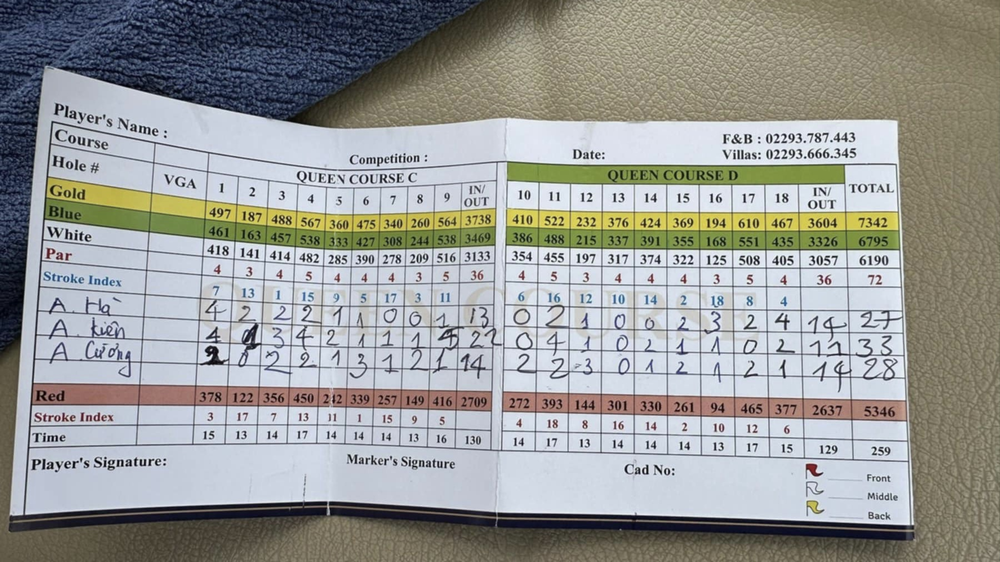

# Golf Score Card Reader

A computer vision application that extracts player names and scores from golf score card images.

## Table of Contents
1. [Introduction](#introduction)
2. [Features](#features)
3. [Installation](#installation)
4. [Project Structure](#project-structure)
5. [Usage](#usage)
6. [Model Training](#model-training)
7. [References](#references)

## Introduction

This repository contains code for automatically reading golf score cards and extracting player information and scores. The system processes images like the example here and outputs formatted results:



Output

```text
A Hà: 4,2,2,2,1,1...
A Kiên: 4,1,3,4,2,1...
A Cường: 2,0,2,2,1...
```

The source dataset can be found [at this repo](https://github.com/Lelekhoa1812/Golf-Scorecard-Scanner/tree/main/dataset/images/train)

## Features

- Automated extraction of player names and scores from score card images
- Support for multiple AI models (Gemini and Qwen2)
- Brightness detection to handle image quality issues
- Streamlit demo application
- Training data generation tools

## Installation

### Prerequisites

1. Install [Anaconda](https://www.anaconda.com/products/distribution)
2. Configure Anaconda environment:

```bash
conda init
conda activate
conda config --set ssl_verify False
pip config set global.trusted-host "pypi.org files.pythonhosted.org pypi.python.org"
```

### Environment Setup

1. Navigate to the project folder
2. Create and activate environment:
```bash
conda create -n golf python=3.10 -y
conda activate golf
pip install -r requirements.txt
```

### API Configuration

For Gemini API usage, create a `.env` file in the root directory:
```env
GEMINI_API_KEY=your_api_key_here
```

## Project Structure

```
├── config/
│   ├── config.yaml           # Inference configuration
│   └── training_config.yaml  # Training dataset configuration
├── src/
│   ├── golf_reader.py       # Base class for score card reading
│   ├── gemini_reader.py     # Gemini model implementation
│   ├── qwen2_reader.py      # Qwen2 model implementation
│   ├── app.py              # Streamlit demo application
│   └── Utils/
│       ├── bright_detect.py           # Image quality detection
│       └── prepare_data_finetune.py   # Training data generation
```

## Usage

### Creating Training Datasets

1. Configure output file and training folder paths in `src/Utils/prepare_data_finetune.py`
2. Add training images to the specified folder
3. Run the preparation script:
```python
qwen_processor.process_images()
```

For ShareGPT format (compatible with [LLaMA-Factory](https://github.com/hiyouga/LLaMA-Factory)), use the `convert_to_sharegpt_format` function.

## Model Training

### Full Finetuning

We use the approach from [zhangfaen/finetune-Qwen2-VL](https://github.com/zhangfaen/finetune-Qwen2-VL) for superior performance compared to LoRA finetuning.

### LoRA Finetuning

Follow [Qwen2-VL training instructions](https://github.com/QwenLM/Qwen2-VL?tab=readme-ov-file#training) using LLaMA-Factory.

Configuration example (`examples/train_lora/qwen2vl_lora_sft.yaml`):
```yaml
    ### model
    model_name_or_path: Qwen/Qwen2-VL-2B-Instruct
    trust_remote_code: true

    ### method
    stage: sft
    do_train: true
    finetuning_type: lora
    lora_target: all

    ### dataset
    dataset: golf_score  # video: mllm_video_demo
    template: qwen2_vl
    cutoff_len: 2048
    max_samples: 1000
    overwrite_cache: true
    preprocessing_num_workers: 16

    ### output
    output_dir: saves/qwen2_vl-2b/lora/sft
    logging_steps: 1
    save_steps: 500
    plot_loss: true
    overwrite_output_dir: true

    ### train
    per_device_train_batch_size: 1
    gradient_accumulation_steps: 8
    learning_rate: 1.0e-4
    num_train_epochs: 10.0
    lr_scheduler_type: cosine
    warmup_ratio: 0.1
    bf16: true
    ddp_timeout: 9000 

    warmup_steps: 100
    weight_decay: 0.1

    ### eval
    val_size: 0.1
    per_device_eval_batch_size: 1
    eval_strategy: steps
    eval_steps: 500
```

Quick training using Makefile:
```make
qwen:
	rm -rf models/qwen2_vl_lora_sft_7b
	rm -rf saves/qwen2_vl-7b
	llamafactory-cli train examples/train_lora/qwen2vl_lora_sft.yaml
	llamafactory-cli export examples/merge_lora/qwen2vl_lora_sft.yaml
	python inference_qwen2.py
```

### CPU Inference with llama.cpp

For llama.cpp inference, refer to:
- [Qwen2-VL GGUF Model](https://www.kaggle.com/models/cngnguyntrnhu/qwen2vl_gguf_quantize4_k_m)
- [Run Qwen2-VL on CPU Guide](https://dev.to/mrzaizai2k/run-qwen2-vl-on-cpu-using-gguf-model-llamacpp-bli)

## References

- [zhangfaen/finetune-Qwen2-VL](https://github.com/zhangfaen/finetune-Qwen2-VL)
- [From Images to JSON: Fine-Tuning Qwen2VL](https://dev.to/mrzaizai2k/how-to-finetune-qwen2-vl-model-on-custom-dataset-3615)
- [LLaMA-Factory](https://github.com/hiyouga/LLaMA-Factory)
- [Qwen2-VL Documentation](https://github.com/QwenLM/Qwen2-VL)